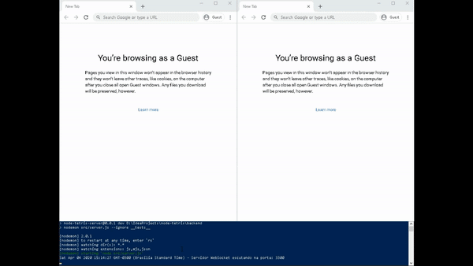

# Node Tetris
Implementação do famoso game tetris para jogar multiplayer, com a intenção e praticar conceitos de comunicação via `websockets` e renderização de GUI no elemento `<canvas>` a partir de `javascript` sem o uso de engines e frameworks.



## Ou você pode jogar para testar

Acesse [https://doli82.github.io/node-tetris/frontend/src/](https://doli82.github.io/node-tetris/frontend/src/) hospedado no Github Pages, com servidor hospedado no Heroku para testar. 

Você pode copiar o link acima e enviar para um amigo!!
## Como Funciona?
- [Backend](#backend)
- [Frontend](#frontend)
- [Instalação em Ambiente de Desenvolvimento](#instalação-em-ambiente-de-desenvolvimento)
- [Protocolo de Mensagens](#protocolo-de-mensagens)

## **Backend**
O servidor do game é escrito em `javascript` com `Node.js` e concentra a comunicação entre aplicações clientes, onde os jogadores poderão criar disputas entre si.

A comunicação é feita com a biblioteca `websocket`, utilizando um protocolo de comunicação exclusivo deste game, criado para troca de mensagens entre os clientes e o servidor.

## **Frontend**
A parte visual deste game usa `javascript` puro e é renderizada no elemento `<canvas>` do HTML sem usar nenhum framework adicional.

## **Configuração em Ambiente de Desenvolvimento**
Os passos a seguir, levam em consideração que você já tenha o Node.js instalado em sua máquina, e esteja dentro da pasta do projeto.
### Subindo o Servidor
Instale as dependências na primeira execução:
````bash
cd backend
npm install
````
 Em seguida inicialize o servidor
````bash
npm run dev
````
### Inicializando o Frontend
Instale as dependências na primeira execução:
````bash
cd frontend
npm install
````
 Para testar o game em computadores diferentes de sua rede, é necessário, abrir o arquivo `config.js` na raiz do projeto frontend e editá-lo, substituindo o valor da propriedade `server_ip` pelo IP do computador que estiver executando o servidor.
 
 Agora, inicialize a interface gráfica que poderá ser acessada em um navegador no endereço padrão http://localhost:5000.
````bash
npm start
````
## **Protocolo de Mensagens**
Todo o protocolo de comunicação do game é semelhante a estrutura do exemplo a seguir, que é o processo que cada cliente executa para iniciar a comunicação com o servidor: 

1. A conexão com o servidor começa com o cliente enviando um pacote de registro:
````js
{
    'type':  'Register',
    'name': 'Player 1'
}
````
2. O servidor responde a mensagem de registro com um pacote contendo a ID do usuário registrado e outro pacote com a lista de usuários conectados:

````js
{
    'type': 'Register',
    'name': 'Player 1',
    'uid': '1b68695c-0e0e',
    'success': true
}
````

````js
{
    'type': 'PlayersList',
    'players': [
        {
            'uid': '52f261f3-a6e8',
            'name': 'Player 1'
        },
        {
            'uid': '1b68695c-0e0e',
            'name': 'Player 2'
        }
    ]
}
````
